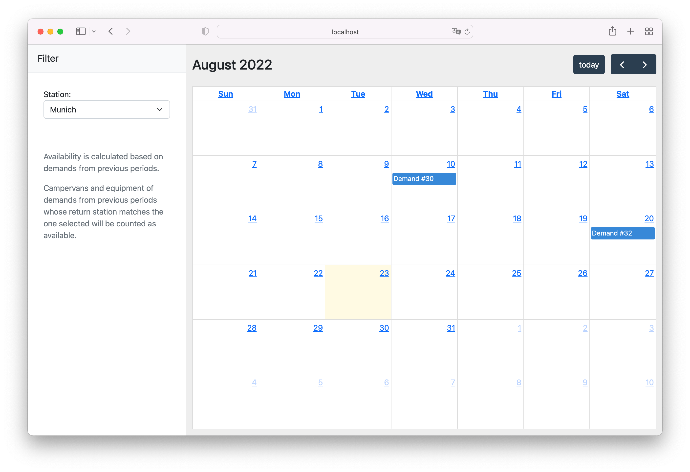
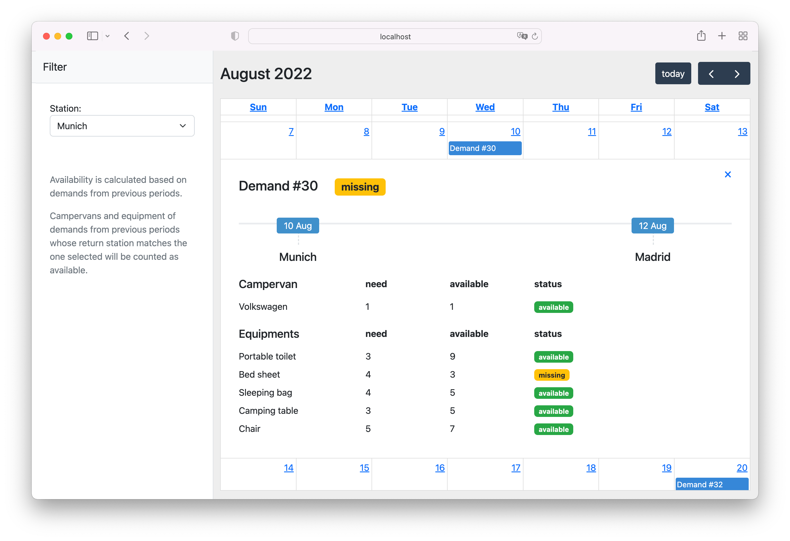

# Equipment Demand Planner

### List of demands:



### Demand details:



## Local environment

**Tech stack:**
 - PHP (Symfony 6.1)
 - DB (Postgres 13.4)
 - Nginx (1.19.4)
 - UI (Angular 13)

**Start local environment:**

Local environment uses docker-compose.

To start project, execute these commands:

```bash
make up-first
make load-data
```

To run phpunit tests:

```bash
make test
```
